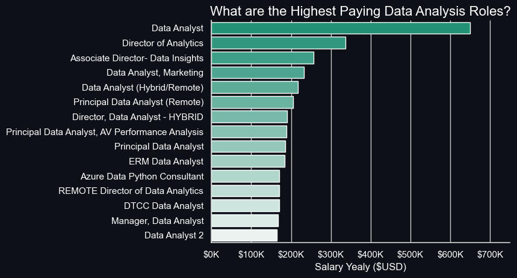
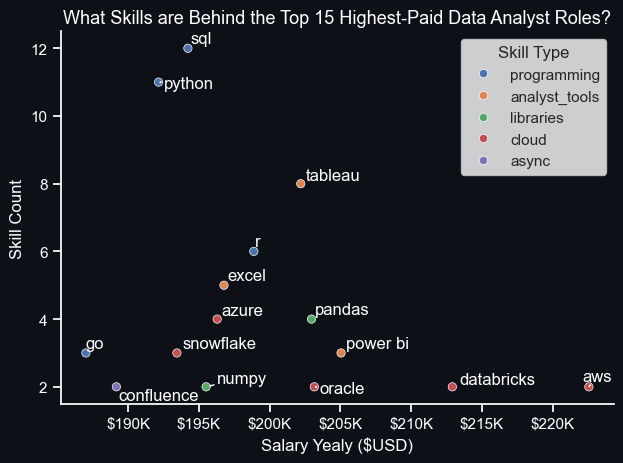
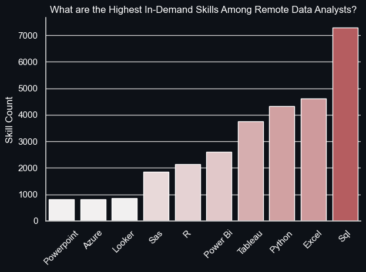
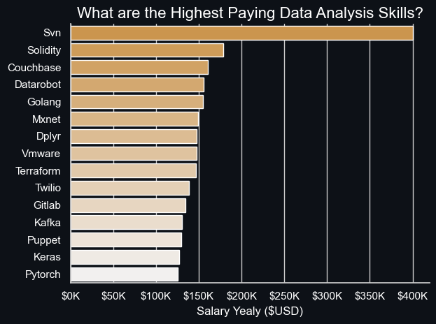
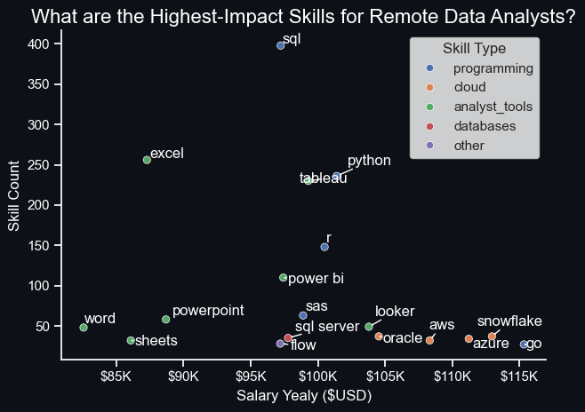

 # Introduction

 Dive into the data job market! This project focuses on Data Analyst roles—exploring the highest-paying positions, the most in-demand skills, and where high salary meets high impact in data analytics.

 Curious about the SQL queries? Check out the [PostgreSQL_project](PostgreSQL_project) folder for all the code used in the analysis.
# Background

This project was driven by a clear goal: to better understand the data analyst job market and make it easier for others to identify valuable opportunities. I aimed to answer essential questions about salary, skills, and market demand by analyzing a real-world job postings [dataset](sql_load) from Luke Barousse's [SQL course](https://www.lukebarousse.com/sql).

The dataset includes job titles, salaries, locations, and required skills—ideal for identifying trends and insights.

### Here are the five main questions that guided my analysis:

  **1. What are the highest-paying Data Analyst roles?**  
  **2. Which skills are most required for the highest-paying Data Analyst roles?**  
  **3. What are the highest in-demand skills for data analysts?**  
  **4. What are the highest-paying skills for Data Analysts?**  
  **5. What are the highest-impact skills to learn as a Data Analyst?**  

 # Tools I Used

To explore these questions, I used a mix of powerful tools:

  - **SQL** – The foundation for extracting, filtering, and analyzing the data.
  - **PostgreSQL** – A robust database management system to manage job postings data.
  - **Visual Studio Code** – My preferred environment for writing and running SQL queries.
  - **Git & GitHub** – For version control, collaboration, and sharing all project files and scripts.
  - **Python (Pandas, Matplotlib, Seaborn)** – Used for processing exported query results, creating meaningful visualizations, and supporting in-depth analysis of the extracted data.

# The Analysis

Each question was answered through structured **SQL queries** and data exploration techniques. Here's how I tackled each:
## 1. What are the highest-paying Data Analyst roles?

I filtered and sorted data analyst roles based on average annual salary, focusing on remote positions. This provided a clear view of which roles offer the **Highest earnings** in the field.

```sql
SELECT
    job_title AS title,
    ROUND(salary_year_avg, 0) AS salary_yearly,
    company_dim.name AS company_Name,
    job_posted_date::DATE
FROM 
    job_postings_fact
LEFT JOIN company_dim ON job_postings_fact.company_id = company_dim.company_id
WHERE 
    salary_year_avg IS NOT NULL AND
    job_title_short = 'Data Analyst' AND
    job_work_from_home = true
ORDER BY 
    salary_year_avg DESC,
    job_id
LIMIT 15
```

*Query Output:*    
|title     |salary_yearly|company_name                                    |job_posted_date|
|----------|-------------|------------------------------------------------|---------------|
|Data Analyst|650000       |Mantys                                          |2023-02-20     |
|Director of Analytics|336500       |Meta                                            |2023-08-23     |
|Associate Director- Data Insights|255830       |AT&T                                            |2023-06-18     |
|Data Analyst, Marketing|232423       |Pinterest Job Advertisements                    |2023-12-05     |
|Data Analyst (Hybrid/Remote)|217000       |Uclahealthcareers                               |2023-01-17     |
|Principal Data Analyst (Remote)|205000       |SmartAsset                                      |2023-08-09     |
|Director, Data Analyst - HYBRID|189309       |Inclusively                                     |2023-12-07     |
|Principal Data Analyst, AV Performance Analysis|189000       |Motional                                        |2023-01-05     |
|Principal Data Analyst|186000       |SmartAsset                                      |2023-07-11     |
|ERM Data Analyst|184000       |Get It Recruit - Information Technology         |2023-06-09     |
|Azure Data Python Consultant - contract to HIRE - Citizen or Perm...|170000       |Kelly Science, Engineering, Technology & Telecom|2023-01-23     |
|REMOTE Director of Data Analytics|170000       |A-Line Staffing Solutions                       |2023-08-09     |
|DTCC Data Analyst|170000       |Robert Half                                     |2023-10-06     |
|Manager, Data Analyst|167000       |Uber                                            |2023-04-18     |
|Data Analyst|165000       |Plexus Resource Solutions                       |2023-12-08     |


### Top Highest-paid Remote Data Analyst Roles in 2023 **Insights**:

   • **Extensive Salary Range:** The highest-paying data analyst positions offer salaries 
   between $184,000 and $650,000, highlighting the strong earning potential within the industry.

   • **Variety of Employers:** High-paying roles are available at companies like SmartAsset, Meta, 
   and AT&T, demonstrating widespread demand for data talent across multiple sectors.

   • **Diverse Job Titles:** From Data Analyst to Director of Analytics, the roles show significant 
   variation, reflecting the wide spectrum of responsibilities and expertise in the data analytics field.

  
*Visualization of the Top 15 Remote Data Analyst jobs ranked by Salary using a Bar Chart. I performed this Visualisation using Python — check it out here:* [visualization.ipynb](visualization/visualization.ipynb)

## 2. Which skills are most required for the highest-paying Data Analyst roles?
To identify the **Skills In-Demand** for **top-paying positions**, I combined job posting data from the previous query with associated skills, offering a clear view of what employers prioritize for roles with higher salaries.

```sql
WITH highest_paying_roles AS (
    SELECT
        job_id,
        job_title AS title,
        salary_year_avg AS salary_yearly
    FROM 
        job_postings_fact
    LEFT JOIN company_dim ON job_postings_fact.company_id = company_dim.company_id
    WHERE 
        salary_year_avg IS NOT NULL AND
        job_title_short = 'Data Analyst' AND
        job_work_from_home = true
    ORDER BY 
    salary_year_avg DESC,
    job_id
    LIMIT 15
)

SELECT  
    skills_dim.skills,
    COUNT(skills_dim.skills) AS skill_count,
    ROUND(AVG(highest_paying_roles.Salary_Yearly), 0) AS Salary_Yearly,
    skills_dim.type
FROM 
    highest_paying_roles
INNER JOIN skills_job_dim ON highest_paying_roles.job_id = skills_job_dim.job_id
INNER JOIN skills_dim ON skills_job_dim.skill_id = skills_dim.skill_id
GROUP BY 
    skills_dim.type,
    skills_dim.skills
    
ORDER BY 
    skill_count DESC
```

*Query Output for the first 15 rows:*    
|skills    |skill_count|salary_yearly                                   |type      |
|----------|-----------|------------------------------------------------|----------|
|sql       |12         |194213                                          |programming|
|python    |11         |192142                                          |programming|
|tableau   |8          |202195                                          |analyst_tools|
|r         |6          |198875                                          |programming|
|excel     |5          |196766                                          |analyst_tools|
|pandas    |4          |202957                                          |libraries |
|azure     |4          |196285                                          |cloud     |
|power bi  |3          |205046                                          |analyst_tools|
|snowflake |3          |193436                                          |cloud     |
|go        |3          |187000                                          |programming|
|databricks|2          |212915                                          |cloud     |
|oracle    |2          |203155                                          |cloud     |
|confluence|2          |189155                                          |async     |
|jira      |2          |189155                                          |async     |
|aws       |2          |222569                                          |cloud     |

### Top Skills in High-Paying Data Analyst Jobs (2023) Insights:

   • **SQL** (12 mentions) and Python (11 mentions) are the most frequently required skills,
     showing their continued dominance in the data field.

   • **Tableau** and **R** also appear prominently, emphasizing the need for data visualization 
    and statistical analysis tools.

   • **AWS** leads with the highest average salary ($222K), followed by Databricks ($213K) and Oracle
   ($203K), highlighting the importance of cloud platforms in modern data environments.  
  
*Scatter plot illustrating the distribution of skills across the 15 highest-earning Remote Data Analyst roles. I performed this Visualisation using Python — check it out here:* [visualization.ipynb](visualization/visualization.ipynb)

## 3. What are the highest in-demand skills for data analysts?
This query revealed the **skills most commonly sought after** in job listings, highlighting key areas of focus for aspiring remote data analysts.

```sql

SELECT  
    skills_dim.skills,
    COUNT(skills) AS skill_count
FROM 
    job_postings_fact
INNER JOIN skills_job_dim ON job_postings_fact.job_id = skills_job_dim.job_id
INNER JOIN skills_dim ON skills_job_dim.skill_id = skills_dim.skill_id
WHERE 
        job_title_short = 'Data Analyst' AND
        job_location = 'Anywhere'
GROUP BY
    skills_dim.skills
ORDER BY skill_count DESC
LIMIT 10
```
*Query Output:*  
|skills    |skill_count|
|----------|-----------|
|sql       |7291       |
|excel     |4611       |
|python    |4330       |
|tableau   |3745       |
|power bi  |2609       |
|r         |2142       |
|sas       |1866       |
|looker    |868        |
|azure     |821        |
|powerpoint|819        |

###  Top Highest In-Demand Skills for Data Analysts, Insights:

   • **SQL** leads by a wide margin with 7,291 mentions, confirming its essential role in data analysis.  
   • **Excel** remains a core skill with 4,611 postings, highlighting its continued relevance.  
   • **Python** is highly sought after (4,330), emphasizing the demand for programming and automation skills.  

  
*Column chart illustrating the demand for the top 10 skills in Remote Data Analyst job postings. I performed this Visualisation using Python — check it out here:* [visualization.ipynb](visualization/visualization.ipynb)

### 4. What are the highest-paying skills for Data Analysts?  
Analyzing the average **salaries** linked to various **skills** helped identify which ones are associated with the **highest-paying** roles.

```sql
SELECT  
    skills_dim.skills,
    ROUND(AVG(salary_year_avg), 0) AS skill_salary
FROM 
    job_postings_fact
INNER JOIN skills_job_dim ON job_postings_fact.job_id = skills_job_dim.job_id
INNER JOIN skills_dim ON skills_job_dim.skill_id = skills_dim.skill_id
WHERE 
        job_title_short = 'Data Analyst'AND
        salary_year_avg IS NOT NULL
GROUP BY
    skills_dim.skills
ORDER BY skill_salary DESC
LIMIT 30
```

*Query Output for the first 15 rows:*  
|skills    |skill_salary|
|----------|------------|
|svn       |400000      |
|solidity  |179000      |
|couchbase |160515      |
|datarobot |155486      |
|golang    |155000      |
|mxnet     |149000      |
|dplyr     |147633      |
|vmware    |147500      |
|terraform |146734      |
|twilio    |138500      |
|gitlab    |134126      |
|kafka     |129999      |
|puppet    |129820      |
|keras     |127013      |
|pytorch   |125226      |

### Highest-Paying Data Analyst Skills, Insights:

   • **SVN** tops the list with a staggering average salary of $400,000, suggesting niche
     or legacy tools can sometimes yield very high compensation when demand outpaces supply.

   • Specialized or emerging tech skills like **Solidity** ($179K), **DataRobot** ($155K), and 
    **MXNet** ($149K) are highly valued, indicating that expertise in cutting-edge AI/ML tools
     and blockchain tech can significantly boost earning potential.

   • **DevOps & Infrastructure** tools such as **Terraform** ($146K), **Puppet** ($129K), and **Ansible**
     ($124K) also appear among top-paying skills, showing the value of cross-functional and
      automation capabilities in data roles.
      
  
*Bar chart showing the average salaries for the top 15 highest-paying skills in data analyst roles. I performed this Visualisation using Python — check it out here:* [visualization.ipynb](visualization/visualization.ipynb)

## 5. What are the highest-impact skills to learn as a Data Analyst?

By merging **demand and salary** data, this query identified skills that are not only highly sought after but also well-compensated, providing a strategic guide for targeted skill development.

```sql
SELECT
    skills_dim.skills,
    ROUND(AVG(job_postings_fact.salary_year_avg), 0) AS salary_yearly,
    COUNT(job_postings_fact.job_id) AS skill_count,
    skills_dim.type
FROM 
    job_postings_fact
INNER JOIN skills_job_dim ON job_postings_fact.job_id = skills_job_dim.job_id
INNER JOIN skills_dim ON skills_job_dim.skill_id = skills_dim.skill_id
WHERE 
    job_postings_fact.job_title_short = 'Data Analyst' AND
    job_postings_fact.job_work_from_home = true AND
    job_postings_fact.salary_year_avg IS NOT NULL
GROUP BY
    skills_dim.skills,
    skills_dim.type
HAVING
    COUNT(job_postings_fact.job_id) > 25
ORDER BY 
    salary_yearly DESC
LIMIT 50
```

*Query Output:*    
|skills    |salary_yearly|skill_count|type         |
|----------|-------------|-----------|-------------|
|go        |115320       |27         |programming  |
|snowflake |112948       |37         |cloud        |
|azure     |111225       |34         |cloud        |
|aws       |108317       |32         |cloud        |
|oracle    |104534       |37         |cloud        |
|looker    |103795       |49         |analyst_tools|
|python    |101397       |236        |programming  |
|r         |100499       |148        |programming  |
|tableau   |99288        |230        |analyst_tools|
|sas       |98902        |63         |programming  |
|sas       |98902        |63         |analyst_tools|
|sql server|97786        |35         |databases    |
|power bi  |97431        |110        |analyst_tools|
|sql       |97237        |398        |programming  |
|flow      |97200        |28         |other        |
|powerpoint|88701        |58         |analyst_tools|
|excel     |87288        |256        |analyst_tools|
|sheets    |86088        |32         |analyst_tools|
|word      |82576        |48         |analyst_tools|

### Highest-Impact Skills for Data Analysts, Insights: 

   • **Go** stands out as the highest-paying skill ($115,320),
     followed by **Snowflake** ($112,948), and **Azure** ($111,225).

   • These are mostly cloud and **programming** technologies, 
    reflecting high demand in modern data infrastructure.

   • All **cloud-related** skills (**Snowflake, Azure, AWS, Oracle**) 
    have salaries over $100,000, confirming the strong value of 
    cloud expertise in today's job market.

   
*Scatter plot highlighting the most optimal skills for remote Data Analysts, ranked by average salary. I performed this Visualisation using Python — check it out here:* [visualization.ipynb](visualization/visualization.ipynb)

# What I Learned

Throughout this journey, I’ve supercharged my **SQL** skills with powerful new capabilities:

• **Advanced Query Building:** Gained expertise in crafting complex queries, seamlessly joining tables and leveraging `WITH` clauses for efficient temporary data structures.

• **Data Aggregation Mastery:** Became confident with GROUP BY and aggregate functions like `COUNT()` and `AVG()`, making data summarization second nature.

• **Analytical Problem-Solving:** Sharpened my ability to tackle real-world problems by transforming questions into clear, insightful **SQL queries**.

• **Visualization with Python:** While **SQL** was the core focus of this project, I used **Python** libraries like **Matplotlib, Pandas, and Seaborn** to visualize the results. A full breakdown of the **Python** side is beyond this scope, but you can check out the detailed **Python** review here: [My_Python_Data_Analytics_Project](https://github.com/DamtanX/My_Python_Data_Analytics_Project).

# Special Thanks
I would like to extend my sincere thanks to Luke Barousse for offering a comprehensive Data Analyst course and sharing a rich dataset with his subscribers, including myself. His content was instrumental in building my understanding of SQL's role in Data Analysis and served as the foundation for this project. I also want to acknowledge ChatGPT, which provided valuable support and guidance throughout the development of this project.

# Conclusion

This project offered a deep dive into the **Data Analyst** job market, uncovering valuable insights into salaries, skill demand, and the tools that drive success in the field. Through rigorous **SQL** querying and thoughtful data exploration, I identified not only the **top-paying roles** but also the most **in-demand and high-impact skills** that aspiring analysts should focus on.

While the primary emphasis was on **SQL** and database analysis, **Python** played a supporting role in bringing the data to life through clear and compelling visualizations. Together, these tools provided a powerful lens through which to understand career trends and strategically guide professional development.

Whether you're just starting your journey or aiming to level up in the data field, the findings in this project can serve as a roadmap to help you prioritize the most rewarding and relevant skills.
